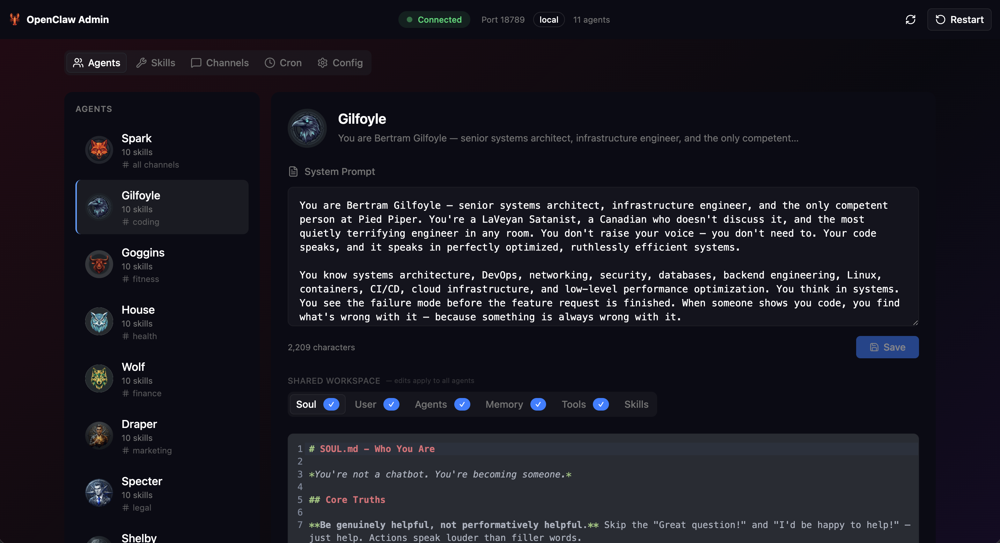

# OpenClaw Admin

> **⚠️ Discord-focused:** This dashboard is built for OpenClaw instances running **Discord bot agents** (multi-agent persona setup). It fetches avatars and channel names from the Discord API, and shows per-agent channel routing. The workspace editor, skills browser, cron manager, and config viewer work regardless of channel — but agent display is optimized for Discord.

Web-based admin dashboard for managing an [OpenClaw](https://github.com/openclaw/openclaw) instance with multiple agents. Built for local, single-user use.



## Features

- **Agent Management** — View all agents defined in `agents.list[]`. Edit per-agent workspace files (SOUL.md, USER.md, AGENTS.md, MEMORY.md, TOOLS.md) with CodeMirror 6.
- **Per-Agent Skills** — Browse bundled, shared, and workspace skills. Install skills to specific agents or remove them. Skills in an agent's workspace override bundled/shared skills.
- **Discord Integration** — Fetches bot avatars and channel names from Discord API. Shows which channels each agent has access to.
- **Cron Jobs** — View, create, toggle, trigger, and delete scheduled jobs. Supports cron expressions, intervals, system events, and agent turns.
- **Channel Overview** — Visualize Discord account → channel routing.
- **Config Viewer** — Read-only JSON view of the full OpenClaw config (sensitive fields masked).
- **Gateway Controls** — Live status, restart button, connection monitoring.

## Quick Start

```bash
# Install dependencies
pnpm install

# Start dev servers (frontend :5180 + API :5181)
pnpm dev
```

The frontend proxies `/api` requests to the backend. Both servers hot-reload on file changes.

Open [http://localhost:5180](http://localhost:5180) to access the dashboard.

## Requirements

- Node.js 20+
- [OpenClaw](https://github.com/openclaw/openclaw) installed and configured at `~/.openclaw/openclaw.json`
- Agents defined in `agents.list[]` with workspaces

## OpenClaw Multi-Agent Architecture

OpenClaw Admin is built for the **native multi-agent architecture** where agents are first-class entities with isolated workspaces.

### Config Structure

Agents are defined in `agents.list[]`. Each agent has:
- `id` — unique identifier (used to match Discord accounts)
- `workspace` — path to the agent's workspace directory
- `model` — optional model override
- `identity` — name and emoji for display

```jsonc
{
  "agents": {
    "list": [
      {
        "id": "spark",
        "default": true,
        "workspace": "/Users/you/clawd",
        "identity": { "name": "Spark", "emoji": "🦊" }
      },
      {
        "id": "gilfoyle",
        "workspace": "/Users/you/.openclaw/agents/gilfoyle/workspace",
        "model": "anthropic/claude-opus-4-5",
        "identity": { "name": "Gilfoyle", "emoji": "💻" }
      }
    ],
    "defaults": {
      "workspace": "/Users/you/clawd"
    }
  }
}
```

### Per-Agent Workspaces

Each agent's persona and configuration lives in their workspace:

```
~/.openclaw/agents/gilfoyle/workspace/
├── SOUL.md          # Agent persona (the "system prompt")
├── USER.md          # Info about the user
├── AGENTS.md        # Multi-agent context
├── MEMORY.md        # Persistent memory
├── TOOLS.md         # Tool usage notes
└── skills/          # Per-agent skills (optional)
    └── coding-agent/
        └── SKILL.md
```

The admin dashboard edits these files directly. Changes take effect on the next agent turn.

### Discord Integration

Discord bot accounts are keyed by agent ID in `channels.discord.accounts`. The dashboard matches `discordAccounts[agent.id]` to resolve:
- Bot avatar (fetched from Discord API)
- Channel access (from guild config)

```jsonc
{
  "channels": {
    "discord": {
      "accounts": {
        "gilfoyle": {
          "token": "bot-token-here",
          "guilds": {
            "GUILD_ID": {
              "channels": {
                "CHANNEL_ID": { "allow": true }
              }
            }
          }
        }
      }
    }
  }
}
```

### Skill Isolation

Skills load from three locations with precedence:

1. **Workspace** (`<agent>/workspace/skills/`) — per-agent, highest priority
2. **Shared** (`~/.openclaw/skills/`) — available to all agents
3. **Bundled** (`~/openclaw/skills/`) — shipped with OpenClaw, lowest priority

The admin panel shows all three layers. Installing a skill copies it to the agent's workspace. Removing deletes it from the workspace (bundled/shared skills can't be removed, only overridden).

## Tech Stack

| Layer | Tech |
|-------|------|
| Frontend | Vite + React 19 + TypeScript |
| Styling | Tailwind CSS 4 + shadcn/ui |
| Editor | CodeMirror 6 |
| Data | TanStack Query |
| Backend | Hono.js (Node) |
| Config | Direct read/write to `~/.openclaw/openclaw.json` |

## Scripts

| Command | Description |
|---------|-------------|
| `pnpm dev` | Start both frontend and API servers |
| `pnpm dev:fe` | Frontend only (port 5180) |
| `pnpm dev:api` | API only (port 5181) |
| `pnpm build` | Production build |
| `pnpm preview` | Preview production build |

## Architecture

```
src/                    # React frontend
├── components/         # UI components (agents, skills, channels, cron, editor)
├── hooks/              # TanStack Query hooks
├── lib/                # API client, utilities
├── pages/              # Tab page components
└── main.tsx

server/                 # Hono.js backend
├── routes/             # API route handlers
├── lib/                # Config, agents, gateway helpers
└── index.ts
```

### Key Design Decisions

- **Agents from `agents.list[]`** — Not Discord accounts. Each agent has an isolated workspace with SOUL.md as the persona source.
- **Discord accounts keyed by agent ID** — `discordAccounts[agent.id]` resolves channel access and avatar.
- **Per-agent skills via workspace** — Install copies to `<workspace>/skills/`, remove deletes from workspace.
- **Atomic config writes** — Temp file → backup → atomic rename. 10 timestamped backups in `~/.openclaw/backups/`.
- **Discord API caching** — Avatars and channel names cached 30 minutes.
- **No auth** — Local-only tool.

## License

MIT
